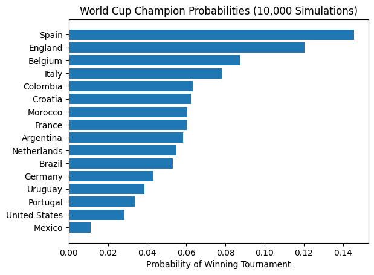
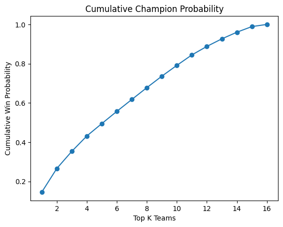

# 🏆 Probabilistic FIFA World Cup Outcome Modeling (2026)

> **End-to-end data project demonstrating skills across Data Analytics, Data Engineering, and Data Science**

This project builds a **probabilistic system to estimate FIFA World Cup winners** using historical international match data, time-aware feature engineering, interpretable machine learning, and Monte Carlo tournament simulations.

The goal is **not just to predict a single winner**, but to **quantify uncertainty**, simulate thousands of tournament outcomes, and present results through clean analytics and visualizations.

---

## 📌 Project Highlights

* ✅ End-to-end pipeline: **raw data → features → model → simulation → insights**
* ✅ Time-aware feature engineering (no data leakage)
* ✅ Interpretable model with coefficient analysis
* ✅ Monte Carlo tournament simulation (10,000+ runs)
* ✅ Role-flexible: suitable for **Data Analyst, Data Engineer, and Data Scientist** roles

---

## 🧠 Problem Statement

> *Can we estimate the probability of each national team winning the FIFA World Cup using historical match performance while accounting for uncertainty and randomness inherent in tournament play?*

Instead of producing a single deterministic prediction, this project:

* Estimates **match-level win probabilities**
* Propagates uncertainty through **full tournament simulations**
* Produces **championship probability distributions**

---

## 📂 Project Structure

```
world-cup-outcome-modeling/
│
├── data/
│   ├── raw/                # Original Kaggle dataset
│   ├── processed/          # Cleaned data
│   └── features/           # Engineered features
│
├── scripts/              # Data engineering pipeline
│   ├── ingest.py
│   ├── feature_engineering.py
│   └── run_pipeline.py
│
├── notebooks/
│   ├── 01_eda.ipynb
│   ├── 02_modeling.ipynb
│   └── 03_simulation.ipynb
│
├── models/
│   ├── soccer_model.pkl
│   └── soccer_scaler.pkl
│
├── report/       (In Progress)
│   └── final_report.pdf
│
└── README.md
```

---

## 📊 Data Source

* **Dataset**: International Football Results (Kaggle / OpenFootball)
* **Coverage**: 1872 – 2024
* **Filtering**: Matches from **2010 onward** to reflect modern football

### Key Raw Fields

* Match date
* Home team / Away team
* Scores
* Tournament type
* Neutral venue flag

---

## 🔧 Data Engineering Pipeline (Step-by-Step)

This project is designed so **beginners can follow the full data flow**.

### Step 1: Ingestion

* Load raw CSV data
* Parse dates
* Filter invalid or missing records

### Step 2: Normalization

* Convert matches into **long format** (one row per team per match)
* Standardize columns: `team`, `opponent`, `team_score`, `win`

### Step 3: Feature Engineering (Time-Aware)

Rolling features are computed **per team**, using **only past matches**.

Key features:

* `avg_goals_last_5`
* `avg_goals_conceded_last_5`
* `win_rate_last_5`
* `avg_goal_diff_last_5`
* `days_since_last_match`

📌 **Design Decision**: All rolling features are shifted by 1 match to prevent data leakage.

---

## 📐 Modeling Approach

### Model Choice: Logistic Regression

Why logistic regression?

* Interpretable coefficients
* Probabilistic output
* Stable and explainable
* Common in quantitative modeling

### Target

* Binary match outcome (win / loss)

### Input Representation

Instead of raw features, we model **feature differences** between two teams:

```
X = team_A_features − team_B_features
```

This allows the model to learn **relative strength**, not absolute values.

---

## 📈 Model Evaluation & Metrics

* ROC-AUC used for probability quality
* Coefficient inspection for interpretability
* Sanity checks on feature signs

### Example Coefficients

| Feature                   | Effect   |
| ------------------------- | -------- |
| avg_goal_diff_last_5      | 0.143740 |
| avg_goals_last_5          | 0.093878 |
| win_rate_last_5           | 0.028106 |

📌 **Insight**: Goal differential is a stronger signal than raw win rate.

---

## 🎲 Tournament Simulation (Monte Carlo)

### Why Simulation?

Single predictions hide uncertainty. Simulation allows us to:

* Estimate **full probability distributions**
* Measure variance and stability
* Analyze upsets

### Process

1. Sample match outcomes using model probabilities
2. Simulate knockout rounds
3. Repeat 10,000+ times
4. Count tournament winners

### Output

* Champion probability per team

* Cumulative probability curves


---

## 📊 Visualizations

Key plots included in the project:

* Champion probability bar chart
* Cumulative probability distribution
* Monte Carlo convergence plot

These visualizations make probabilistic results **interpretable and actionable**.

---

## 📉 Key Results (Example)

Rank,Team,Probability,Win %
1,🇪🇸 Spain,0.1457,14.57%
2,🏴󠁧󠁢󠁥󠁮󠁧󠁿 England,0.1203,12.03%
3,🇧🇪 Belgium,0.0874,8.74%
4,🇮🇹 Italy,0.0781,7.81%
5,🇨🇴 Colombia,0.0632,6.32%
6,🇭🇷 Croatia,0.0623,6.23%
7,🇲🇦 Morocco,0.0606,6.06%
8,🇫🇷 France,0.0602,6.02%
9,🇦🇷 Argentina,0.0585,5.85%
10,🇳🇱 Netherlands,0.0550,5.50%
11,🇧🇷 Brazil,0.0532,5.32%
12,🇩🇪 Germany,0.0434,4.34%
13,🇺🇾 Uruguay,0.0386,3.86%
14,🇵🇹 Portugal,0.0338,3.38%
15,🇺🇸 United States,0.0286,2.86%
16,🇲🇽 Mexico,0.0111,1.11%

📌 Results represent **model-implied odds**, not guarantees.

---

## ⚠️ Limitations

* No player-level data
* No group-stage modeling
* Static team strength assumption
* Neutral venue treated uniformly

---

## 🚀 Future Improvements

* Elo or Bayesian team strength updates
* Group-stage simulation
* Player-level metrics
* Live data ingestion via API
* Automated retraining pipeline

---

## 👔 Role-Specific Skills Demonstrated

### Data Analyst

* Exploratory data analysis
* Visual storytelling
* Dashboard-ready metrics

### Data Engineer

* Reproducible pipelines
* Feature validation
* Modular pipeline design

### Data Scientist

* Time-aware feature engineering
* Probabilistic modeling
* Simulation-based evaluation

---

## ▶️ How to Run the Project

```bash
pip install -r requirements.txt
python pipelines/run_pipeline.py
jupyter notebook notebooks/
```

---

## 📎 Resume Summary Line

> Built a probabilistic football outcome modeling system using time-aware feature engineering and Monte Carlo tournament simulation to estimate championship probabilities.

---

## ⭐ Final Notes

This project is intentionally designed to be:

* Beginner-friendly
* Interview-ready
* Extendable to real-world systems

If you’re new to data projects, **start with the notebooks**. If you’re evaluating this as a hiring manager, **start with the report and dashboard**.

---

📫 Questions or suggestions welcome!
